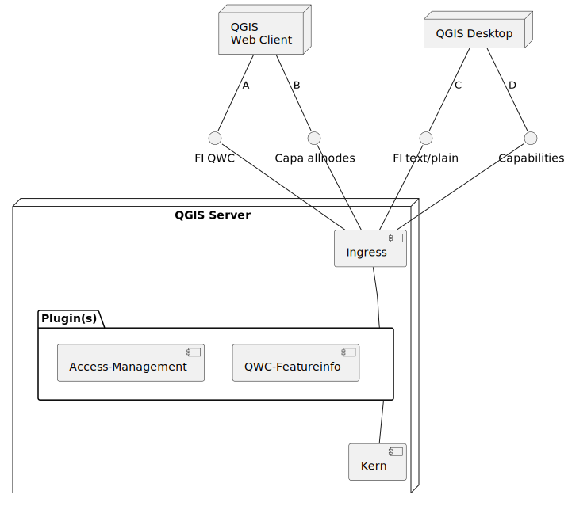

# Ziele

*	Vereinfachung der Deployment-Architektur
*	«Entmengung» der Aspekte
    *	Access Management
    *	«WGC Featureinfo»
    *	Facadelayer / Layerbaum

# Lösungsvorchlag

Der Lösungsvorschlag wird anhand der Request-Pfade A - D erkläutert

## A: Featureinfo für QGIS WebClient

Ablauf:
1.	Request an QGIS-Server mit URL-Parameter «info_format=application/vnd.spl.qwc».
1.	Access Management Plugin: Prüfung, ob der Benutzer berechtigt ist, die Ebenen abzufragen.
1.	WGC-Featureinfo Plugin:
    1.	«Rewrite» info_format auf «text/xml» oder «application/json»
    1.	Weiterreichung an «Kern»
    1.	Anwenden des Jinja-Templates auf die Response
    1.	Rückgabe der Response

##	B: QWC GetCapabilities

Ablauf:
1.	GetCapabilities Request and QGIS-Server mit Parameter «allnodes=true»
2.	Kern gibt den ganzen Layerbaum zurück
3.	Access Management Plugin: Kein Filtern von Response-Inhalten aufgrund «allnodes=true»

##	C: QGIS Desktop GetCapabilities

Ablauf:
1.	GetCapabilities Request and QGIS-Server ohne Parameter allnodes oder «allnodes=false»
1.	Kern gibt für Facadelayer die Kinder nicht zurück
1.	Access Management Plugin: Entfernt die für den Benutzer nicht berechtigten Ebenen aus der GetCapabilities Response heraus.

##	D: Featureinfo für QGIS Desktop

Ablauf:
1.	Request an QGIS-Server mit einem der von QGIS Server im Kern unterstützten Info-Formate.
1.	Access Management Plugin: Prüfung, ob der Benutzer berechtigt ist, die Ebenen abzufragen.

# Bemerkungen

* Ein oder zwei Plugins: Anzustreben sind zwei Plugins. Falls aber aufgrund nicht ausreichender "Verkettungs-Konfiguration" von Plugins in QGIS Server Probleme auftreten, müssen die beiden Aspekte "Access-Management" und "QWC-Featureinfo" in einem Plugin implementiert werden. Vorgehen darum:
    * Starten mit zwei Plugins
    * Bei unlösbaren "Verkettungs-Problemen": Vereinigen in ein Plugin

# Fragen

* Ist es möglich, mit dieser "Stossrichtung" auf die Komponenten "OGC-Service" und "Featureinfo-Service" zu verzichten?
* Ist dies auch für weitere Kunden ein Mehrwert / eine Vereinfachung? 